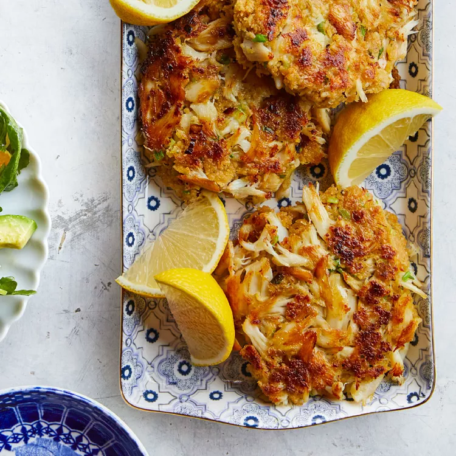

# Shrimp and Lobster Dip.md

## Prep Time
- 20 minutes

## Total Time
- 45 minutes

## Servings
- 6 servings

## Serving Size
-

## Ingredients
- 4 tablespoons unsalted butter, divided in half
- 1 large egg, beaten
- 1/4 lb shrimp, peeled and the tail removed
- 1/4 lb lobster, diced roughly
- 4 green onions, roughly 5 tbsps, finely chopped
- 1/3 lb smoked Gouda cheese, grated
- 1 cup Mozzarella cheese, grated
- 1 pint heavy whipping cream
- 2 tbsp white wine
- 3/4 tsp smoked paprika
- 1/4 cup sun dried tomatoes, finely chopped
- salt & ground black pepper, to taste
- chips, to serve
- parsley, to serve

## Instructions
1. Preheat your oven to 350 degrees F.
2. Saute your tomatoes and onions in 2 tablespoons of melted butter.
3. Add both seafoods and saute briefly.
4. Deglaze with white wine and reduce briefly.
5. Season to taste with salt and pepper. Adjust accordingly and set aside.
6. Using the same pan, melt the remaining butter and add the cream. Bring to a simmer.
7. Remove from the heat and slowly stir in ½ of each shredded/grated cheeses and egg; stir in paprika until well combined.
8. Fold in the cooked lobster and shrimp into the sauce until well combined.
9. Transfer mixture into a small casserole dish; sprinkle remaining cheese on top.
10. Bake until brown around the edges.
11. Garnish with parsley, and serve together with chips

## Notes

## Nutrition Facts
|| Amount per Serving |
|-----------------|------:|
| Calories        | 550   |
| Total Fat       | 49g   |
| Carbohydrates   | 7g    |
| Protein         | 21g   |

## Source
- Original recipe from [Recipes.net](https://recipes.net/side-dish/dip-sauces/copycat-longhorn-steak-house-shrimp-lobster-dip-recipe/)