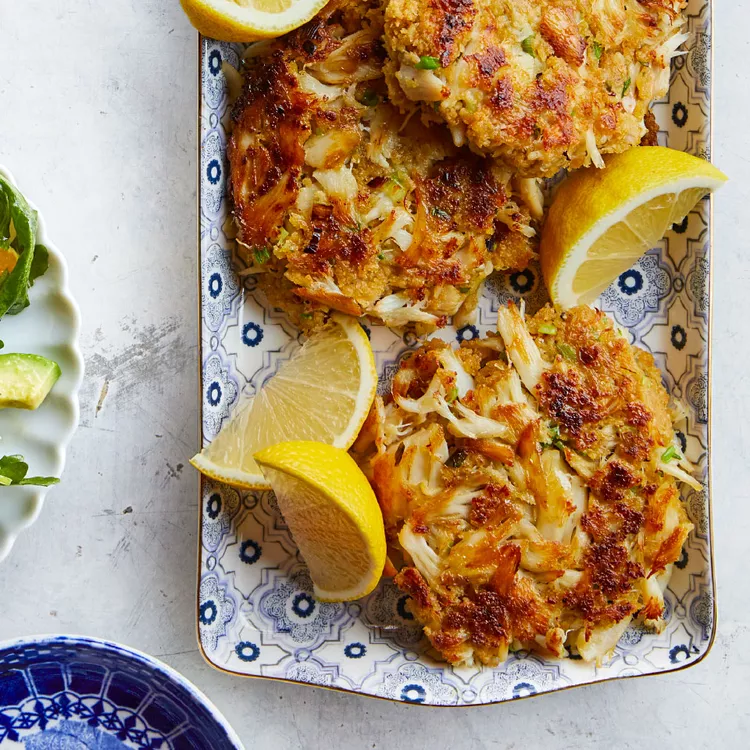

# Speedy Crab Cakes

## Prep Time
- 20 minutes

## Total Time
- 20 minutes

## Servings
- 4 servings

## Serving Size
- 1 crab cake

## Ingredients
- 1 large egg
- 2 tablespoons mayonnaise
- 2 teaspoons Dijon mustard
- 1/4 teaspoon ground black pepper
- pinch of salt
- pinch of cayenne pepper
- 1/4 cup chopped scallions
- 12 ounces jumbo lump crabmeat, drained and picked over
- 3/4 cup panko breadcrumbs, preferably whole-wheat
- 2 tablespoons extra-virgin olive oil

## Instructions
1. Whisk egg, mayonnaise, mustard, pepper, salt and cayenne in a medium bowl until combined. Stir in scallions. Add crab and panko; stir to combine. Form the mixture into four 1/2-inch-thick patties.
2. Heat oil in a large nonstick skillet over medium-high heat until shimmering. Add the crab cakes and cook, turning once, until golden brown, 4 to 5 minutes per side. Serve with lemon wedges.

## Notes

## Nutrition Facts
|| Amount per Serving |
|-----------------|------:|
| Calories        | 239   |
| Total Fat       | 14g   |
| Carbohydrates   | 8g    |
| Protein         | 19g   |

## Source
- Original recipe from [EatingWell](https://www.eatingwell.com/recipe/270474/speedy-crab-cakes/)