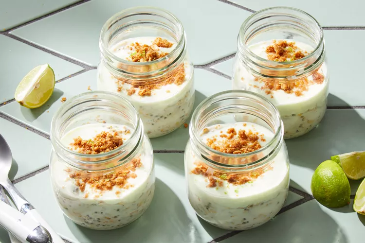

# Key Lime Pie Overnight Oats

## Prep Time
- 25 minutes

## Total Time
- 8 hours 25 minutes (including overnight refrigeration)

## Servings
- 4 servings

## Serving Size
- about 3/4 cup oat mixture & 1 Tbsp. graham cracker topping

## Ingredients
- 2 cups old-fashioned rolled oats
- 2 cups whole milk
- 2 tablespoons chia seeds
- 1 tablespoon sweetened condensed milk
- 2-1/2 teaspoons grated Key lime zest, divided
- 1/4 teaspoon salt
- 1/4 teaspoon vanilla extract
- 5 ounces Key Lime Greek Yogurt
- 2 tablespoons fresh Key lime juice (from about 5 Key limes)
- 1/4 cup graham cracker crumbs
- 1 tablespoon unsalted butter, melted
- 2 teaspoons granulated sugar

## Instructions
1. Preheat oven to 350°F. Line a large rimmed baking sheet with parchment paper.
2. Whisk oats, milk, chia seeds, condensed milk, 2 teaspoons lime zest, salt and vanilla together in a medium bowl until fully combined.
3. Divide the mixture among 4 (8-ounce) lidded containers, about 3/4 cup each. Whisk yogurt and lime juice in a small bowl until blended. Top each jar with about 2 1/2 tablespoons of the yogurt mixture. Refrigerate, covered, until the oats have absorbed the liquid and the mixture is thickened, at least 8 hours or up to 24 hours.
4. Combine graham cracker crumbs, butter and sugar in a small bowl; mix with a fork until crumbly and the texture of wet sand. Spread into an even layer on the prepared baking sheet. Bake until golden brown and fragrant, 5 to 7 minutes. Let cool on the pan, about 15 minutes.
5. To serve, stir the yogurt mixture into the oat mixture. Top each serving with 1 tablespoon of the graham cracker mixture and sprinkle with 1/8 teaspoon lime zest. Garnish with a Key lime wedge, if desired.

## Notes
- Prepare graham cracker mixture (Step 4) up to 3 days in advance; store in an airtight container at room temperature.

## Nutrition Facts
|| Amount per Serving |
|-----------------|------:|
| Calories        | 365   |
| Total Fat       | 13g   |
| Carbohydrates   | 49g   |
| Protein         | 15g   |

## Source
- Original recipe from [EatingWell](https://www.eatingwell.com/key-lime-pie-inspired-overnight-oats-8400186)