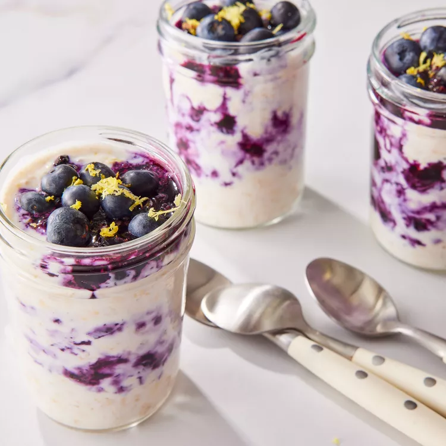

# Lemon-Blueberry Overnight Oats

## Prep Time
- 15 minutes

## Total Time
- 12 hours 15 minutes (including overnight refrigeration)

## Servings
- 4 servings

## Serving Size
- 1 cup

## Ingredients
- 2-1/2 tablespoons Pure Maple Syrup
- 1 tablespoon Grated Lemon Zest, divided
- 1 tablespoon lemon juice
- 1-3/4 cups fresh blueberries, divided
- 2 cups unsweetened vanilla almond milk
- 1 cup nonfat plain Greek yogurt
- 1/4 teaspoon salt
- 2-1/4 cups old-fashioned rolled oats

## Instructions
1. Combine maple syrup, lemon juice and 1 1/2 cups blueberries in a small saucepan; bring to a simmer over medium-high heat. Simmer, covered, stirring occasionally, until the blueberries are slightly softened and a syrup forms, 5 to 8 minutes. Set aside to cool.
2. Whisk almond milk, yogurt, salt and 2 teaspoons lemon zest together in a large bowl until smooth. Fold in oats until well combined.
3. Add 1/4 cup of the oat mixture to each of 4 (1-cup) jars with lids; top each with 1 tablespoon of the blueberry mixture. Repeat the layering process 2 times. Cover the jars and refrigerate for 12 hours (or up to 3 days).
4. Before serving, top with the remaining 1/4 cup blueberries and 1 teaspoon lemon zest.
5. In the morning, stir the oats and add additional toppings if desired.

## Notes
- Can be stored in the refrigerator for up to 3 days.

## Nutrition Facts
|| Amount per Serving |
|-----------------|------:|
| Calories        | 281   |
| Total Fat       | 4g    |
| Carbohydrates   | 48g   |
| Protein         | 14g   |

## Source
- Original recipe from [EatingWell](https://www.eatingwell.com/recipe/8062561/lemon-blueberry-overnight-oats/)