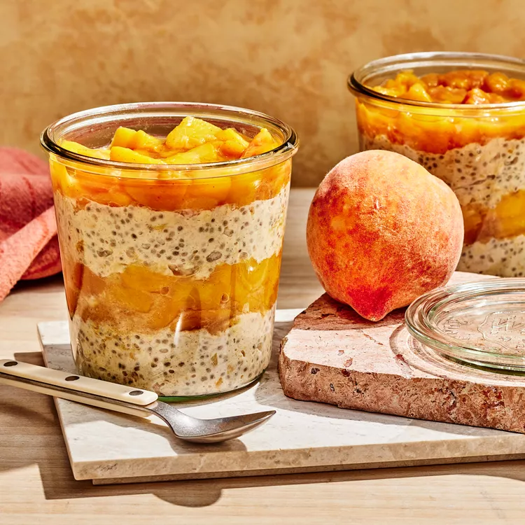

# Peach Pie Overnight Oats

## Prep Time
- 25 minutes

## Total Time
- 8 hours 25 minutes (including overnight refrigeration)

## Servings
- 4 servings

## Serving Size
- 1 cup oats & 2/3 cup peaches

## Ingredients
- 4 fresh peaches, peeled and chopped (3 cups)
- 1/4 cup water
- 1 tablespoon light brown sugar
- 1 teaspoon ground cinnamon, divided
- 1/2 teaspoon salt, divided
- 2 cups old-fashioned rolled oats
- 1-3/4 cups whole milk
- 1 cup nonfat peach Greek yogurt
- 2 tablespoons chia seeds
- 2 tablespoons vanilla extract

## Instructions
1. Place peaches, water, brown sugar, 1/2 teaspoon cinnamon and 1/4 teaspoon salt in a medium saucepan. Cook, uncovered, over medium-low heat, stirring occasionally, until the water has evaporated and the peaches are fork-tender, 6 to 7 minutes. Transfer the mixture to a medium bowl; let cool to room temperature, about 30 minutes. Cover and refrigerate until ready to assemble oats.
2. Meanwhile, whisk oats, milk, yogurt, chia seeds, vanilla and the remaining 1/2 teaspoon cinnamon and 1/4 teaspoon salt in a medium bowl until fully combined. Cover and refrigerate until slightly thickened, at least 8 hours.
3. To assemble, spoon 1/2 cup oat mixture into each of 4 (16-ounce) jars; top each with 1/3 cup peach mixture. Repeat the layers with the remaining oats and peaches.

## Notes
- Can be stored in the refrigerator for up to 3 days.

## Nutrition Facts
|| Amount per Serving |
|-----------------|------:|
| Calories        | 360   |
| Total Fat       | 8g    |
| Carbohydrates   | 53g   |
| Protein         | 18g   |

## Source
- Original recipe from [EatingWell](https://www.eatingwell.com/peach-pie-overnight-oats-8668392)