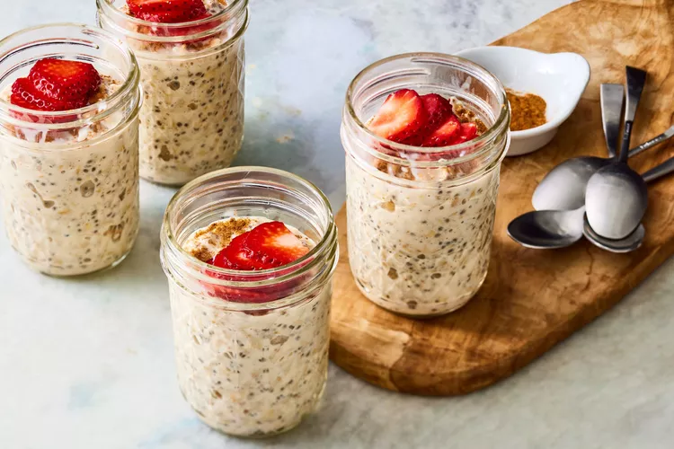

# Tres Leches Overnight Oats

## Prep Time
- 15 minutes

## Total Time
- 8 hours 15 minutes (including overnight refrigeration)

## Servings
- 4 servings

## Serving Size
- 3/4 cup oats & 2 Tbsp. strawberries

## Ingredients
- 1 cup whole milk
- 1 cup whole evaporated milk
- 3 tablespoons sweetend condensed milk, plus 2 teaspoons; divided
- 2 tablespoons chia seeds
- 2 teaspoons vanilla extract
- 1/4 teaspoon salt
- 2 cups old-fashioned rolled oats
- 1/4 teaspoon ground cinnamon
- 1/2 cup sliced fresh strawberries

## Instructions
1. Whisk whole milk, evaporated milk, 3 tablespoons condensed milk, chia seeds, vanilla and salt together in a medium bowl until fully combined. Fold in oats.
2. Spoon 3/4 cup of the oat mixture into each of 4 (8-oz.) jars. Cover and refrigerate for at least 8 hours and up to 4 days.
3. Just before serving, drizzle each jar of oats with 1/2 teaspoon condensed milk. Sprinkle with cinnamon; top each jar with 2 tablespoons strawberries. Serve chilled.

## Notes
- Refrigerate oat mixture (Steps 1 & 2) for up to 4 days. When ready to serve, proceed with Step 3.

## Nutrition Facts
|| Amount per Serving |
|-----------------|------:|
| Calories        | 313   |
| Total Fat       | 10g   |
| Carbohydrates   | 44g   |
| Protein         | 12g   |

## Source
- Original recipe from [EatingWell](https://www.eatingwell.com/recipe/8066165/tres-leches-overnight-oats/)