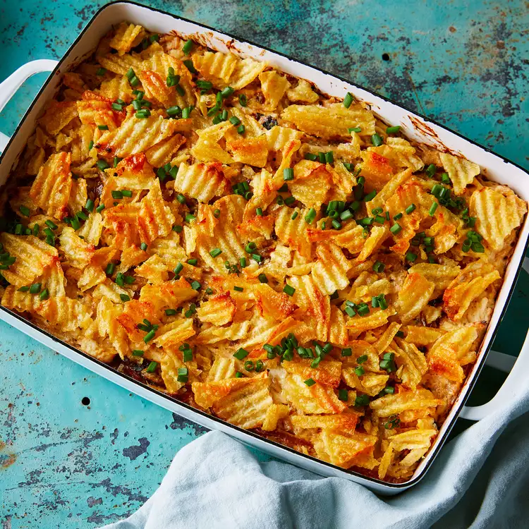

# French Onion Dip Chicken & Rice Casserole

## Prep Time
- 50 minutes

## Total Time
- 1 hour 30 minutes

## Servings
- 6 servings

## Serving Size
- 1 cup

## Ingredients
- 1 tablespoon unsalted butter
- 2 large yellow onions, thinly sliced (about 6 cups)
- 1 (8-ounce) package cream cheese, softened
- 3/4 cup plain Greek yogurt
- 1/2 teaspoon salt
- 1/2 teaspoon ground pepper
- 1/2 teaspoon onion powder
- 1/4 teaspoon garlic powder
- 1/4 teaspoon cayenne pepper
- 1 pound shredded cooked chicken breast
- 2 cups cooked long-grain brown rice
- 1-1/2 cups coarsely crushed crinkle-cut potato chips
- Chopped fresh chives for garnish

## Instructions
1. Preheat oven to 400°F. Coat an 8-inch square (2-quart) baking dish with cooking spray; set aside. Melt butter in a large nonstick skillet over medium heat. Add onions; cook, stirring occasionally, until translucent and starting to brown, about 20 minutes. Reduce heat to medium-low; cook, stirring often, until the onions are very tender and brown throughout, 15 to 20 minutes. Remove from heat.
2. Combine cream cheese, yogurt, salt, pepper, onion powder, garlic powder and cayenne in a large bowl. Beat with an electric mixer on medium speed until smooth, about 1 minute. Fold in chicken, rice and the cooked onions. Spoon the mixture into the prepared baking dish. Sprinkle with crushed potato chips and cover with foil.
3. Bake until bubbly, about 30 minutes. Remove the foil and continue baking until the topping is crispy and lightly browned, about 10 minutes. Garnish with chives, if desired.

## Notes
- Prepare through Step 2 and refrigerate for up to 2 days or freeze for up to 1 month (thaw in the refrigerator overnight before baking).

## Nutrition Facts
|| Amount per Serving |
|-----------------|------:|
| Calories        | 400   |
| Total Fat       | 20g   |
| Carbohydrates   | 36g   |
| Protein         | 22g   |

## Source
- Original recipe from [EatingWell](https://www.eatingwell.com/recipe/7884702/french-onion-dip-chicken-rice-casserole/)