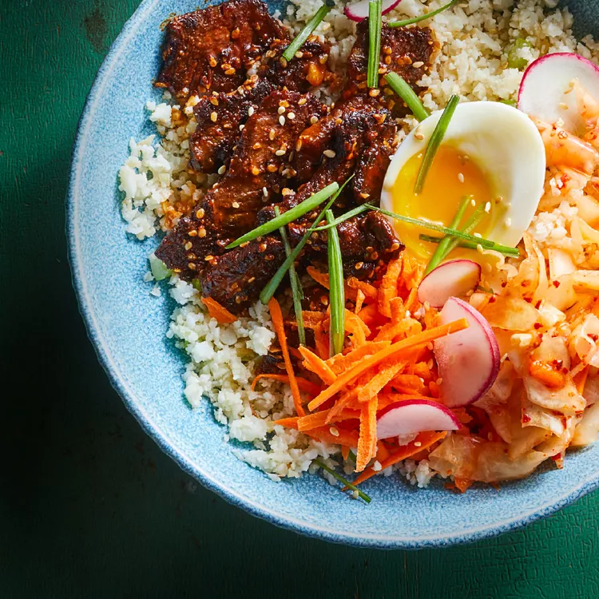

# Gochujang Steak, Kimchi & Cauliflower Rice Bowls

## Prep Time
- 30 minutes

## Total Time
- 30 minutes

## Servings
- 4 servings

## Serving Size
- 2 cups

## Ingredients
- 2 large eggs
- 4 tablespoons toasted sesame oil, divided
- 6 cups riced cauliflower
- 2 scallions, sliced, greens and whites separated
- 1 tablespoon minced ginger
- 1/4 teaspoon salt
- 1 pound sirloin steak, thinly sliced
- 1/4 cup gochujang
- 2 tablespoons toasted sesame seeds
- 1 cup shredded carrots
- 1/2 cup kimchi
- 1 ounce sliced radishes for garnish

## Instructions
1. Bring a medium saucepan of water to a boil over high heat. Set a bowl of ice water near the stove. Using a spoon, gently lower eggs into the boiling water. Reduce heat to maintain a rapid simmer. Cook for 7 minutes. Transfer the eggs to the ice bath and let cool for 5 minutes. Peel the eggs and slice in half.
2. Meanwhile, heat 2 tablespoons oil in a large skillet over medium-high heat. Add cauliflower, scallion whites, ginger and salt. Cook, stirring frequently, until the cauliflower is softened, about 5 minutes. Transfer to a bowl and cover to keep warm. Wash and dry the pan.
3. Heat the remaining 2 tablespoons oil in the pan over medium-high heat. Add steak and cook, stirring, until no longer pink, 2 to 4 minutes. Remove from heat and stir in gochujang and sesame seeds.
4. To assemble, divide the cauliflower among 4 bowls. Top with the steak, carrots, kimchi, half an egg, scallion greens and radishes, if desired.

## Notes

## Nutrition Facts
|| Amount per Serving |
|-----------------|------:|
| Calories        | 529   |
| Total Fat       | 34g   |
| Carbohydrates   | 24g   |
| Protein         | 32g   |

## Source
- Original recipe from [EatingWell](https://www.eatingwell.com/recipe/269784/korean-steak-kimchi-cauliflower-rice-bowls/)