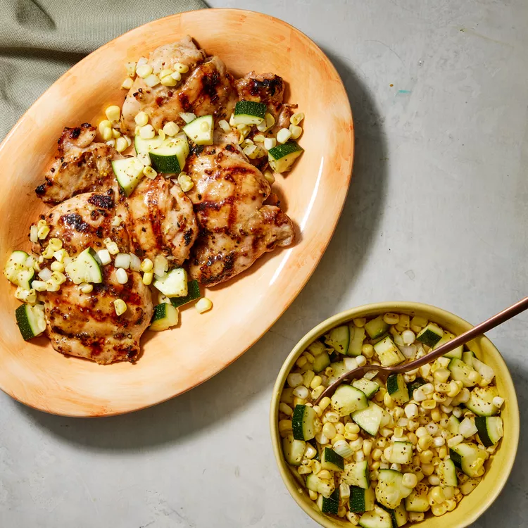

# Grilled Honey-Mustard Chicken with Zucchini-Corn Relish

## Prep Time
- 20 minutes

## Total Time
- 20 minutes

## Servings
- 4 servings

## Serving Size
- 3 oz. chicken & 1/2 cup relish

## Ingredients
- 2 tablespoons cider vinegar
- 1-1/2 teaspoons granulated sugar
- 1/2 teaspoon celery seed
- 1/8 teaspoon ground turmeric
- 1/2 teaspoon salt, divided
- 1 cup diced zucchini
- 1 cup corn kernels (from 1 ear)
- 1/4 cup finely diced onion
- 1 tablespoon honey
- 1 tablespoon whole-grain mustard
- 1 tablespoon avocado oil
- 1/4 teaspoon ground black pepper
- 4 large boneless, skinless chicken thighs (~1-1/4 pounds), trimmed

## Instructions
1. Preheat grill to medium-high.
2. Whisk vinegar, sugar, celery seed, turmeric and 1/4 teaspoon salt together in a medium bowl. Stir in zucchini, corn and onion, Set aside, stirring occasionally.
3. Combine honey, mustard and oil in a small bowl. Sprinkle chicken with the remaining 1/4 teaspoon salt and pepper, then brush with half the honey-mustard mixture.
4. Grill the chicken, brushing with the remaining honey-mustard mixture, until an instant-read thermometer inserted into the thickest part registers 165°F, 3 to 5 minutes per side. Serve the chicken with the zucchini relish.

## Notes

## Nutrition Facts
|| Amount per Serving |
|-----------------|------:|
| Calories        | 308   |
| Total Fat       | 17g   |
| Carbohydrates   | 15g   |
| Protein         | 25g   |

## Source
- Original recipe from [EatingWell](https://www.eatingwell.com/recipe/8061715/grilled-honey-mustard-chicken-with-zucchini-corn-relish/)