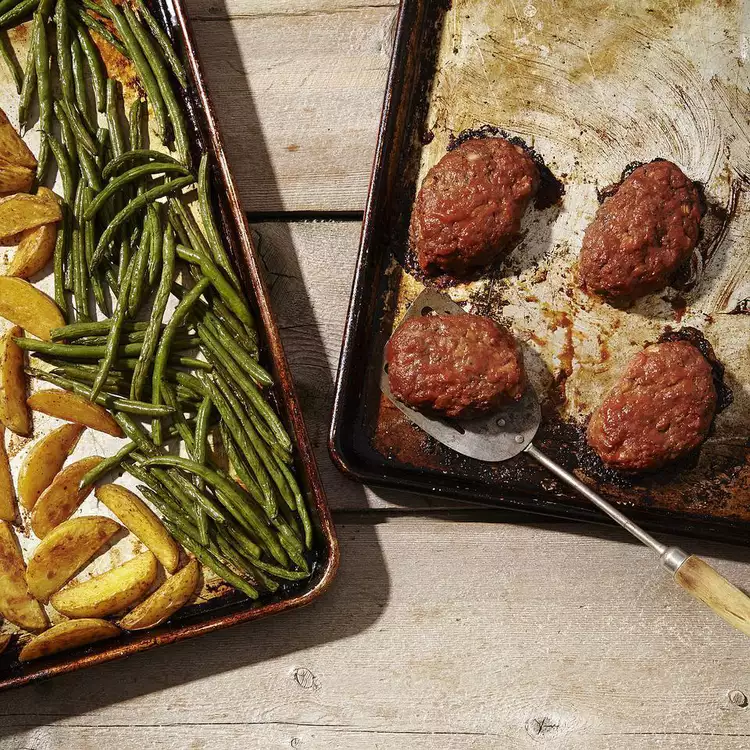

# Mini Meatloaves with Green Beans & Potatoes

## Prep Time
- 20 minutes

## Total Time
- 40 minutes

## Servings
- 4 servings

## Serving Size
- 1 mini meatloaf & 3/4 cup each potatoes & green beans

## Ingredients
- 1/2 teaspoon paprika
- 1/2 teaspoon garlic powder, divided
- 3/4 teaspoon salt, divided
- 3/4 teaspoon ground black pepper, divided
- 1 pound Yukon Gold or red potatoes, scrubbed and cut into 1 inch wedges
- 2 tablespoons extra-virgin olive oil, divided
- 1 pound lean (90% or leaner) ground beef
- 1 large egg, lightly beaten
- 1/4 cup finely chopped onion
- 1/4 cup Italian-seasoned panko breadcrumbs
- 3 tablespoons ketchup, divided
- 1 tablespoon Worcestershire Sauce
- 1 pound green beans, trimmed

## Instructions
1. Position racks in upper and lower thirds of oven; preheat to 425 degrees F. Coat 2 large rimmed baking sheets with cooking spray.
2. Combine paprika and 1/4 teaspoon each garlic powder, salt and pepper in a large bowl. Add potatoes and toss to coat. Drizzle with 1 tablespoon oil, toss again, then spread the potatoes in a single layer on one of the prepared baking sheets. (Reserve the bowl.) Place on the lower rack to roast for 10 minutes.
3. Meanwhile, combine beef, egg, onion, breadcrumbs, 2 tablespoons ketchup, Worcestershire and 1/4 teaspoon each garlic powder, salt and pepper in the large bowl. Form the mixture into 4 small loaves about 2 by 4 inches each and place on the other prepared baking sheet. Brush the tops with the remaining 1 tablespoon ketchup. Remove the potatoes from the oven and put the meatloaves on the lower rack.
4. Toss green beans with the remaining 1 tablespoon oil and 1/4 teaspoon each salt and pepper. Move the potatoes to one side of their pan and add the green beans to the other side. Roast the vegetables on the upper rack until the green beans are tender and an instant-read thermometer inserted into the center of the meatloaves registers 165 degrees F, 20 to 30 minutes more.

## Notes

## Nutrition Facts
|| Amount per Serving |
|-----------------|------:|
| Calories        | 500   |
| Total Fat       | 24g   |
| Carbohydrates   | 38g   |
| Protein         | 36g   |

## Source
- Original recipe from [EatingWell](https://www.eatingwell.com/recipe/253043/mini-meatloaves-with-green-beans-potatoes/)