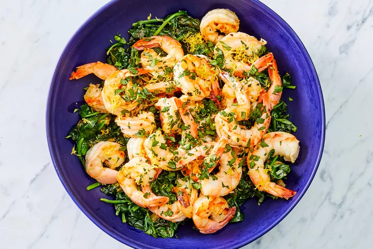

# One-Pot Garlic Shrimp and Spinach

## Prep Time
- 25 minutes

## Total Time
- 25 minutes

## Servings
- 4 servings

## Serving Size
- 1 cup

## Ingredients
- 3 tablespoons extra-virgin olive oil, divided
- 6 medium cloves garlic, sliced, divided
- 1 pound spinach
- 1/4 teaspoon salt plus 1/8 teaspoon, divided
- 1 tablespoon lemon juice
- 1 pound shrimp (21-30 count), peeled and deveined
- 1/4 teaspoon crushed red pepper
- 1 tablespoon finely chopped fresh parsley
- 1-1/2 teaspoons lemon zest

## Instructions
1. Heat 1 tablespoon oil in a large pot over medium heat. Add half the garlic and cook until beginning to brown, 1 to 2 minutes. Add spinach and 1/4 teaspoon salt and toss to coat. Cook, stirring once or twice, until mostly wilted, 3 to 5 minutes. Remove from heat and stir in lemon juice. Transfer to a bowl and keep warm.
2. Increase heat to medium-high and add the remaining 2 tablespoons oil to the pot. Add the remaining garlic and cook until beginning to brown, 1 to 2 minutes. Add shrimp, crushed red pepper and the remaining 1/8 teaspoon salt; cook, stirring, until the shrimp are just cooked through, 3 to 5 minutes more. Serve the shrimp over the spinach, sprinkled with lemon zest and parsley.

## Notes

## Nutrition Facts
|| Amount per Serving |
|-----------------|------:|
| Calories        | 297   |
| Total Fat       | 19g   |
| Carbohydrates   | 12g   |
| Protein         | 21g   |

## Source
- Original recipe from [EatingWell](https://www.eatingwell.com/recipe/269496/one-pot-garlicky-shrimp-spinach/)