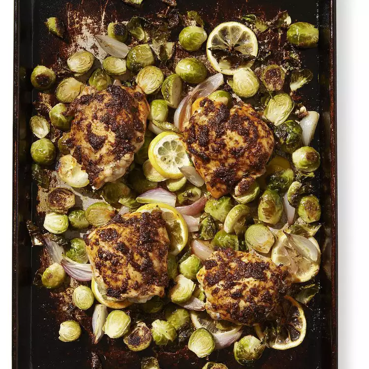

# Paprika Chicken Thighs with Brussels Sprouts

## Prep Time
- 20 minutes

## Total Time
- 40 minutes

## Servings
- 4 servings

## Serving Size
- 1 large or 2 small thighs & 3/4 cup vegetables

## Ingredients
- 1 pound Brussels sprouts, trimmed and halved (or quartered if large)
- 4 small shallots, quartered
- 1 lemon, sliced
- 3 tablespoons extra-virgin olive oil, divided
- 3/4 teaspoon salt, divided
- 1/2 teaspoon ground black pepper, divided
- 2 cloves garlic, minced
- 1 tablespoon smoked paprika, sweet or hot
- 1 teaspoon dried thyme
- 4 large or 8 small bone-in chicken thighs (about 2 1/2 pounds), skin removed

## Instructions
1. Position rack in lower third of oven; preheat to 450 degrees F.
2. Combine Brussels sprouts, shallots and lemon with 2 tablespoons oil and 1/4 teaspoon each salt and pepper on a large rimmed baking sheet.
3. Mash garlic and the remaining 1/2 teaspoon salt with the side of a chef's knife to form a paste. Combine the garlic paste with paprika, thyme and the remaining 1 tablespoon oil and 1/4 teaspoon pepper in a small bowl. Rub the paste all over chicken. Nestle the chicken into the Brussels sprouts.
4. Roast on the lower rack until the Brussels sprouts are tender and an instant-read thermometer inserted into the thickest part of the chicken without touching bone registers 165 degrees F, 20 to 25 minutes.

## Notes
- *Tip:* Cut Down on Dishes: A rimmed baking sheet is great for everything from roasting to catching accidental drips and spills. For effortless cleanup and to keep your baking sheets in tip-top shape, line them with a layer of foil before each use.

## Nutrition Facts
|| Amount per Serving |
|-----------------|------:|
| Calories        | 483   |
| Total Fat       | 24g   |
| Carbohydrates   | 29g   |
| Protein         | 61g   |

## Source
- Original recipe from [EatingWell](https://www.eatingwell.com/recipe/253042/paprika-chicken-thighs-with-brussels-sprouts/)