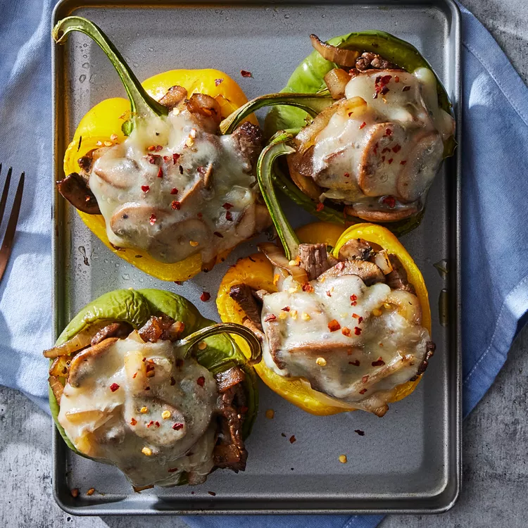

# Philly Cheesesteak Stuffed Peppers

## Prep Time
- 40 minutes

## Total Time
- 40 minutes

## Servings
- 4 servings

## Serving Size
- 1/2 stuffed pepper

## Ingredients
- 2 large bell peppers, halved lengthwise, seeds removed
- 1 tablespoon extra-virgin olive oil
- 1 large onion, halved and sliced
- 1 (8 ounce) package mushrooms, thinly sliced
- 1 pound top round steak, thinly sliced
- 1 tablespoon Italian seasoning
- 1/2 teaspoon ground black pepper
- 1/4 teaspoon salt
- 1 tablespoon Worcestershire Sauce
- 4 slices provolone cheese

## Instructions
1. Preheat oven to 375°F.
2. Place pepper halves on a rimmed baking sheet. Bake until tender but still holding their shape, about 30 minutes.
3. Meanwhile, heat oil in a large skillet over medium heat. Add onion and cook, stirring, until starting to brown, 4 to 5 minutes. Add mushrooms and cook, stirring, until they're softened and release their juices, about 5 minutes more. Add steak, Italian seasoning, pepper and salt; cook, stirring, until the steak is just cooked through, 3 to 5 minutes more. Remove from heat and stir in Worcestershire.
4. Preheat broiler to high. Divide the filling between the pepper halves and top each with a slice of cheese. Broil 5 inches from the heat until the cheese is melted and lightly browned, 2 to 3 minutes.

## Notes
- To keep your meal low-carb, serve Philly Cheesesteak Stuffed Peppers with a side of cauliflower rice or a simple green salad. If you want to enjoy a more classic pairing, roasted potatoes or sweet potatoes go nicely with this easy recipe.

## Nutrition Facts
|| Amount per Serving |
|-----------------|------:|
| Calories        | 347   |
| Total Fat       | 14g   |
| Carbohydrates   | 11g   |
| Protein         | 42g   |

## Source
- Original recipe from [EatingWell](https://www.eatingwell.com/recipe/270428/philly-cheesesteak-stuffed-peppers/)