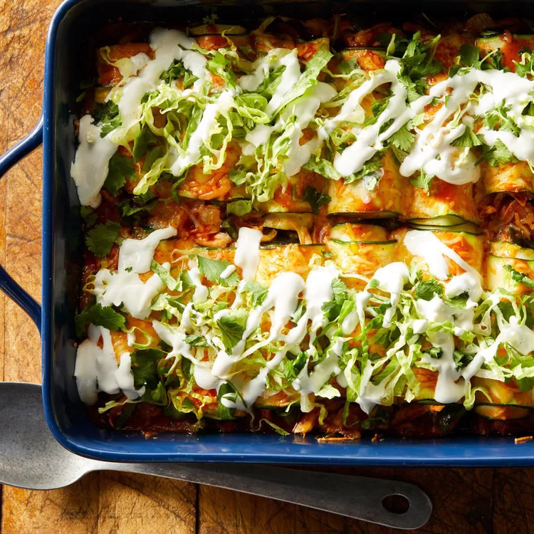

# Zucchini Enchiladas

## Prep Time
- 35 minutes

## Total Time
- 1 hour 10 minutes

## Servings
- 4 servings

## Serving Size
- 4 enchiladas

## Ingredients
- 2 tablespoons extra-virgin olive oil
- 1 medium onion, chopped
- 1 poblano pepper, seeded and chopped
- 1/4 teaspoon salt
- 12 ounces cooked chicken breast, shredded (about 3 cups)
- 1 cup shredded Mexican-blend cheese, divided
- 15 ounce enchilada sauce, divided
- 3 medium zucchini (about 1 pound), trimmed
- 1/3 cup sour cream
- 3 tablespoons whole milk
- 1 cup shredded romaine lettuce
- 1/2 cup chopped fresh cilantro

## Instructions
1. Preheat oven to 425 degrees F. Heat oil in a large skillet over medium-high heat. Add onion, poblano and salt. Cook, stirring frequently, until the vegetables have softened and are beginning to brown, about 6 minutes. Reduce heat to medium if vegetables start to burn. Transfer to a large bowl. Add chicken, 1/2 cup cheese and 1/2 cup enchilada sauce. Stir to combine; set aside.
2. Using a vegetable peeler or mandolin slicer, slice zucchini lengthwise into thin strips (see Tip). Discard any uneven and broken pieces. You should end up with 48 slices.
3. Spread 1/4 cup enchilada sauce on the bottom of a 9-by-13-inch baking dish. Lay three strips of zucchini on a clean work surface, overlapping the edges by 1/4 inch or so. Place 2 generous tablespoons of the chicken filling across the middle of the zucchini strips. Gently roll the zucchini strips around the filling and place seam-side down in the prepared dish. Repeat with the remaining zucchini strips and filling. (You should have 16 enchiladas.) Top the zucchini rolls with the remaining 3/4 cup enchilada sauce and 1/2 cup cheese.
4. Bake until the sauce is bubbling and the cheese is melted, 20 to 25 minutes.
5. Meanwhile, whisk sour cream and milk together in a small bowl. When the enchiladas have finished baking, top with lettuce and cilantro. Drizzle the sour cream mixture over the top.

## Notes
- To make ahead: Assemble enchiladas through Step 3. Refrigerate for up to 1 day.
- *Tip:* The strips should be able to roll around the filling without breaking. Test a few strips to make sure you have the right thickness. If they break, slice them thinner.

## Nutrition Facts
|| Amount per Serving |
|-----------------|------:|
| Calories        | 427   |
| Total Fat       | 25g   |
| Carbohydrates   | 14g   |
| Protein         | 35g   |

## Source
- Original recipe from [EatingWell](https://www.eatingwell.com/recipe/264489/zucchini-enchiladas/)