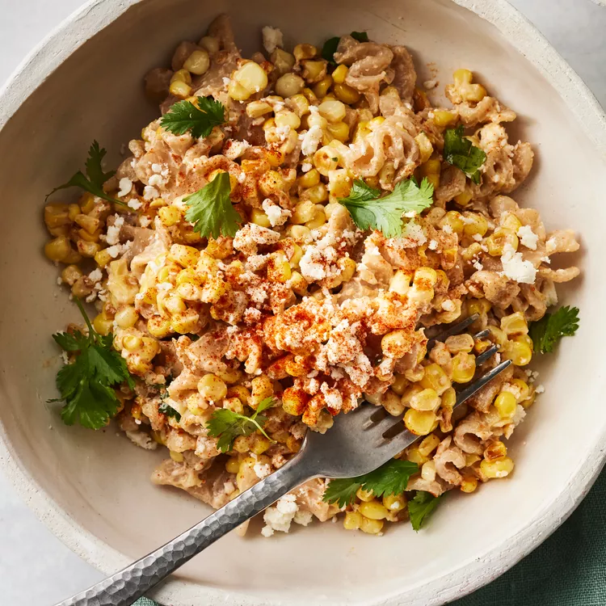

# Elote-Inspired Pasta Salad

## Prep Time
- 20 minutes

## Total Time
- 30 minutes

## Servings
- 6 servings

## Serving Size
- generous 3/4 cup

## Ingredients
- 6 ounces small whole-wheat pasta such as reginetti or elbows (about 2 1/2 cups)
- 1 tablespoon extra-virgin olive oil
- 3 cups fresh corn kernels (from 4 to 5 ears) or thawed frozen corn kernels
- 4 tablespoons crema Mexicana or sour cream
- 4 tablespoons light mayonnaise
- 1/2 teaspon grated lime zest
- 1 tablespoon lime juice
- 1/2 teaspoon salt
- 1 small clove garlic, grated
- 4 tablespoons crumbled cotija cheese, divided
- 2 tablespoons chopped fresh cilantro, divided
- 1/4 teaspoon smoked paprika, divided

## Instructions
1. Bring a large pot of water to a boil; cook pasta according to package directions. Drain thoroughly; spread in an even layer on a baking sheet to cool.
2. Heat oil in a large skillet over medium-high heat. Add corn; cook, undisturbed, until blistered, about 2 minutes. Stir and spread into an even layer; cook, stirring every 2 minutes, until charred in many spots, about 4 minutes. Transfer to the baking sheet with the pasta. Let cool to room temperature, about 15 minutes.
3. Meanwhile, combine crema (or sour cream), mayonnaise, lime zest, lime juice, salt, garlic, 2 tablespoons cotija, 1 tablespoon cilantro and 1/8 teaspoon paprika together in a large bowl; whisk until well combined. Reserve 2 tablespoons of the crema mixture in a small bowl. Add the pasta-corn mixture to the remaining crema mixture in the large bowl; toss to combine. Transfer to a platter or bowl. Drizzle with the reserved 2 tablespoons crema mixture. Sprinkle with the remaining 2 tablespoons cotija, 1 tablespoon cilantro and 1/8 teaspoon paprika.

## Notes

## Nutrition Facts
|| Amount per Serving |
|-----------------|------:|
| Calories        | 249   |
| Total Fat       | 9g    |
| Carbohydrates   | 36g   |
| Protein         | 6g    |

## Source
- Original recipe from [EatingWell](https://www.eatingwell.com/recipe/8052969/elote-inspired-pasta-salad/)